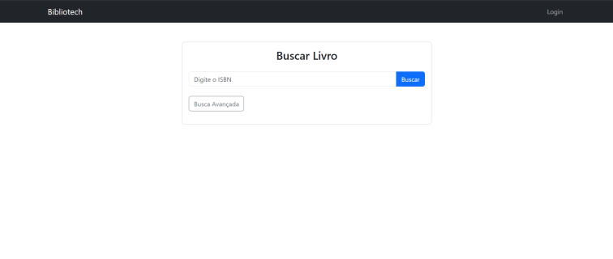

# BiblioTech

<div align="center">
    
</div>

Sistema de gerenciamento digital para bibliotecas que permite catalogar, pesquisar e administrar acervos de livros, gerenciar usuários e empréstimos, além de fornecer um perfil de usuário com histórico de empréstimos e multas. 

## Tecnologias Utilizadas

- **Backend**: Python (Flask)
- **Frontend**: HTML + Jinja2 (templates do Flask)
- **Banco de Dados**: PostgreSQL 15 e conexão via Pyodbc
- **Administração de DB**: pgAdmin 4
- **Migrations**: Yoyo Migrations
- **Containerização**: Docker e Docker Compose
- **Proxy Reverso**: Nginx
- **seed**: Faker para geração de dados fictícios

## Configuração do Ambiente

### Pré-requisitos

- Docker e Docker Compose instalados

### Iniciando o Projeto

1. Clone o repositório:

```bash
git clone [URL_DO_REPOSITORIO]
cd bibliotech-py
```

2. Crie um arquivo `.env` na raiz do projeto com base no `.env.example`:

```bash
cp .env.example .env
```

3. Inicie os containers:

```bash
docker-compose up --build -d
```

4. Instale as dependências:

```bash
docker exec -it bibliotech-app sh

# dentro do container, instale as dependências
pip install -r requirements.txt
```

5. Execute as migrations do banco de dados:

```bash
# dentro do container, aplique as migrations
yoyo apply
```

6. Acesse em <http://localhost:8000>

### Dados de Teste

Para popular o banco com dados fictícios:

```bash
# Acessar container
docker exec -it bibliotech_app sh

# Executar script de seed 
python scripts/seed_database.py
```

### Comandos Úteis

#### Banco de Dados

```bash
#acessar o container do PostgreSQL
docker exec -it bibliotech-postgres bash

# conectar ao banco de dados
psql -U admin -d bibliotech

# comandos úteis para o psql:
\l -> listar bancos de dados
\dt bibliotech.* -> listar tabelas do schema bibliotech
\d bibliotech.users -> descrever estrutura da tabela users
```

#### Migrations

```bash
# criar nova migration
yoyo new ./migrations -m "Descrição da migration"

#aplicar migrations pendentes
yoyo apply

# ver histórico de migrations
yoyo list

# Rollback para migration específica
yoyo rollback --revision [ID_DA_MIGRATION]
```

#### Docker

```bash
# ver logs dos containers
docker-compose logs -f

# parar containers
docker-compose down

# rebuild completo
docker-compose down && docker-compose up --build -d

# acessar bash do container da aplicação
docker exec -it bibliotech-app bash
```

## Estrutura do Projeto

```
bibliotech-py/
├── app/
│   ├── controllers/          # Controladores da aplicação
│   ├── models/              # Modelos de dados
│   ├── repositories/        # Camada de acesso a dados
│   ├── routes/             # Rotas da aplicação
│   ├── services/           # Lógica de negócio
│   ├── utils/              # Utilitários
│   └── __init__.py          # Inicialização do pacote
├── templates/              # Templates Jinja2
│   ├── admin/             # Templates da área administrativa
│   ├── auth/              # Templates de autenticação
│   └── user/               # Templates de usuário  
├── static/                # Arquivos estáticos (CSS, JS, imagens)
├── migrations/            # Migrations do banco de dados (Yoyo)
├── proxy/                  # Configuração do proxy reverso (Nginx)
├── scripts/                # Scripts auxiliares
├── docker-compose.yml     # Configuração do Docker Compose
├── Dockerfile              # Dockerfile da aplicação
├── .env.example            # Exemplo de arquivo de variáveis de ambiente
├── config.py               # Configurações da aplicação separadas por ambiente
├── database.py            # Configuração do banco de dados
├── requirements.txt       # Dependências Python
└── run.py                # Arquivo de entrada da aplicação
```

## Funcionalidades Principais

- **Dashboard Administrativo**: Visão geral das estatísticas da biblioteca
- **Gestão administrativa de Usuários**: Cadastro e gerenciamento de usuários da biblioteca
- **Gestão administrativa de Livros**: Cadastro e Catalogação de livros com autores e status de disponibilidade
- **Gestão administrativa de Autores**: Cadastro e gerenciamento de autores
- **Gestão admnistrativa de Empréstimos**: Registro e controle de empréstimos de livros, devoluções e multas
- **Autenticação**: Login e logout de usuários e administração separados 
- **Perfil de usuário**: Visualização e edição de dados do perfil e painel de empréstimos
- **Painel de empréstimos individual**: Visualização de painel de empréstimos no perfil do usuário, com histórico de empréstimos recentes e status atual
- **Controle de Multas**: Cálculo automático de multas por atraso
- **Busca de Livros**: Pesquisa no acervo da biblioteca por ISBN do livro

## Troubleshooting

### Problemas Comuns

- **Erro de conexão com banco via Pyodbc**: Verifique se o PostgreSQL está rodando e as configurações no arquivo `.env` estão corretas. Geralmente, o .env não é atualizado automaticamente no container, nesse caso, no `config.py`, configue as string hardcoded de conexão com o banco de dados, sem resgatar do .env.
- **Migration failed**: Verifique se o banco está acessível e as credenciais estão corretas no `.env`
- **Import errors**: Certifique-se de que todas as dependências foram instaladas com `pip install -r requirements.txt` dentro do container